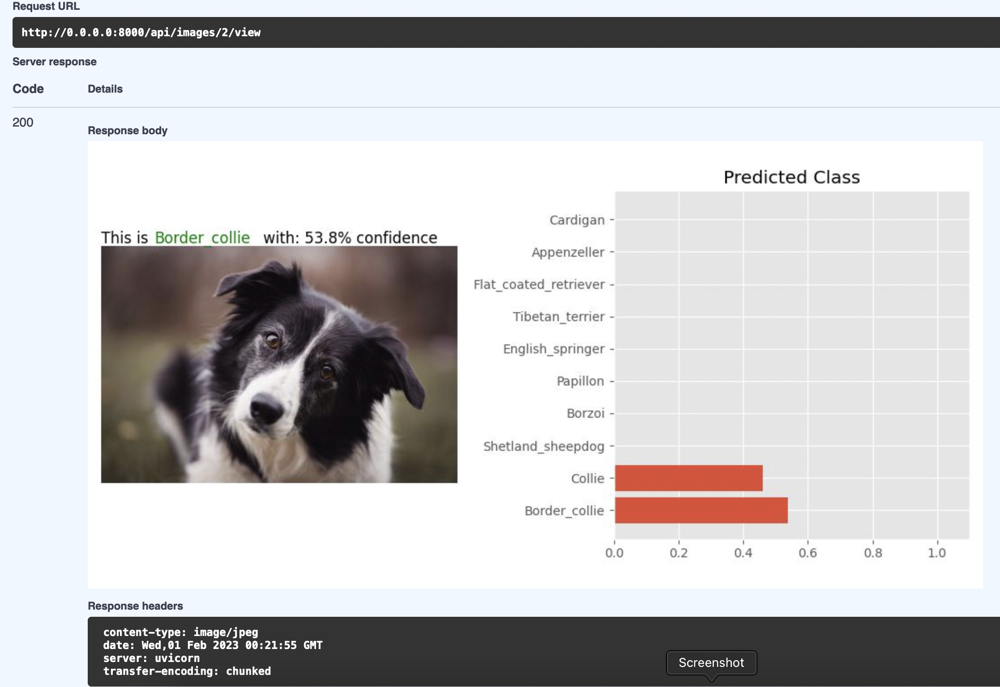

# ML multiclass- classification service

[](https://github.com/lstasiak/StanfordDogs-Classifier-FastApi/actions/workflows/python.yaml)

## About the project
This project consists of the Machine Learning service for image
classification task, created with FastAPI. The project is managed by Docker-Compose app and connects the following
services:
- postgres database
- web service with fastapi
- celery
- redis

All uploaded images are stored in Postgresql database
as defined objects.

#### Goal
The main purpose of this project is to obtain more practice and knowledge about building ML application with FastApi framework
connected with several services in docker containers.

---

**ATTENTION**
Dataset images have to be downloaded from the [Source](http://vision.stanford.edu/aditya86/ImageNetDogs/) and unpacked in the `dataset/`
so the project won't crash at the start.

---

## Dataset & model
The task is defined as the multi-label-classification problem. The chosen
CNN model consists of the base model, which is pre-trained **ResNet18** network
and head model - Sequential model composed of FeedForward Neural Networks.

Dataset for this task consists of 20,580 images of different dog breeds, so
the task is 120-class classification problem.

Currently, saved "best" model performs with ~70% accuracy on validation set, but training
with larger epochs can probably increase this result.

## Functionality

### Starting app on docker
To start the docker-compose application we can simply run (being located in project dir)
in terminal:
```shell
docker-compose up --build
```
or equivalently with make command (using Makefile):
```shell
make build
```
After build is completed we should see then logs of started three services: web, celery and redis.
The API should be accessible on localhost with port 8000 (check logs), e.g. http://0.0.0.0:8000.
### API Walkthrough
To simply test the api functionality we can use documentation: http://0.0.0.0:8000/docs,
check the endpoint and execute `Try it out`
### Upload image
The endpoint for creating new image object is available through: http://0.0.0.0:8000/api/upload.
Fields: `filename` and `ground_truth` are optional and not providing them does
not raise any exceptions (although `ground_truth` is used to confirm predicted class in the image from `images/id/view`
endpoint).

**Example response**:
```python
{
  "filename": "test",
  "file": "long bytes object decoded as str",
  "predictions": null,
  "ground_truth": "papillon",
  "id": 3
}
```
Here `file` field is shown only to confirm the object is being saved in db.

### Making predictions
To start making predictions:
1. Go on http://0.0.0.0:8000/docs
2. Check `api/predict` endpoint and click **Try it out** button.
3. Enter the id of the image that was already uploaded.
4. You can also pass optional device argument ["cpu", "gpu", "mps"] and the inference will be performed on it if the device is accessible, otherwise it will run on default device.
5. Click **Execute** and check the response.

**Example response**:
```python
{
  "data": {
    "task_id": "2befa18a-4108-4909-bd96-f84b44670405",
    "status": "PENDING"
  },
  "message": "Task received"
}
```
### List uploaded images & get image by id
To list all images from db or get specific image object by passing id, use:
http://0.0.0.0:8000/api/images or http://0.0.0.0:8000/api/images/{id}

**Example response** (get image by id):
```python
{
  "data": {
    "filename": "test",
    "predictions": {
      "Papillon": 0.9762507081031799,
      "Shetland_sheepdog": 0.014413505792617798,
      "Pomeranian": 0.003125004470348358,
      "Border_collie": 0.0028909659013152122,
      "Collie": 0.0018272408051416278,
      "Chihuahua": 0.00033904475276358426,
      "Pembroke": 0.00020536882220767438,
      "Borzoi": 0.00018209789413958788,
      "Welsh_springer_spaniel": 0.00013516127364709973,
      "Appenzeller": 0.00010434777504997328,
      "Toy_terrier": 0.00009056834824150428,
      "Samoyed": 0.000052933653932996094,
      "Japanese_spaniel": 0.00005093629442853853,
      "Groenendael": 0.000031502982892561704,
      "Schipperke": 0.00003092475526500493,
      "Keeshond": 0.000023425009203492664,
      "English_springer": 0.000023408794731949456,
      "Cardigan": 0.000018566704966360703,
      "Toy_poodle": 0.00001617132693354506,
      "Italian_greyhound": 0.00001597254777152557,
      "Maltese_dog": 0.000014293143067334313,
      "Yorkshire_terrier": 0.00001391701698594261,
      "Dhole": 0.000013456841770675965,
      "Blenheim_spaniel": 0.0000098424852694734,
      "Shih_tzu": 0.000009299164048570674,
      "English_setter": 0.000008905268259695731,
      "Bernese_mountain_dog": 0.000008354482815775555,
      "Saluki": 0.000007056750291667413,
      "Great_pyrenees": 0.0000059423564380267635,
      "Tibetan_terrier": 0.0000055240730034711305,
      "Malamute": 0.000005304834303387906,
      "Miniature_poodle": 0.000004898203314951388,
      "Affenpinscher": 0.0000044280413931119256,
      "Old_english_sheepdog": 0.000004422340225573862,
      "Afghan_hound": 0.0000042071524148923345,
      "Pekinese": 0.000003988528078480158,
      "Scottish_deerhound": 0.0000036175206332700327,
      "West_highland_white_terrier": 0.0000034796389627445024,
      "Boston_bull": 0.0000032363232094212435,
      "Flat_coated_retriever": 0.0000029643276775459526,
      "Miniature_schnauzer": 0.00000268147391579987,
      "Miniature_pinscher": 0.000002277450448673335,
      "Kuvasz": 0.0000021182790987950284,
      "Beagle": 0.0000020369056983327027,
      "Cairn": 0.0000017380342569595086,
      "Basenji": 0.0000014718439160787966,
      "Saint_bernard": 0.0000014191483614922618,
      "Silky_terrier": 0.0000013275677019919385,
      "Scotch_terrier": 0.0000011942145192733733,
      "Tibetan_mastiff": 0.000001034349679684965,
      "Irish_setter": 9.886762200039811e-7,
      "Entlebucher": 9.773245892574778e-7,
      "Eskimo_dog": 9.415812769475451e-7,
      "Siberian_husky": 8.148131769303291e-7,
      "Dandie_dinmont": 7.600197591273172e-7,
      "Golden_retriever": 7.509389661208843e-7,
      "Brittany_spaniel": 6.986129506003635e-7,
      "Brabancon_griffon": 6.765856710444496e-7,
      "Ibizan_hound": 6.628776532124903e-7,
      "Wire_haired_fox_terrier": 6.592469503630127e-7,
      "Norfolk_terrier": 6.592060799448518e-7,
      "Walker_hound": 6.025947527632525e-7,
      "Gordon_setter": 5.836500918121601e-7,
      "Australian_terrier": 5.566158733927296e-7,
      "Norwich_terrier": 5.196019401410013e-7,
      "Newfoundland": 4.561269122405065e-7,
      "Clumber": 4.5476261334442825e-7,
      "Whippet": 4.411133431858616e-7,
      "Greater_swiss_mountain_dog": 4.3949626160610933e-7,
      "Standard_schnauzer": 4.378133269256068e-7,
      "Standard_poodle": 4.069210035595461e-7,
      "Dingo": 3.645175183919491e-7,
      "Cocker_spaniel": 3.601787170737225e-7,
      "Briard": 3.2644055636410485e-7,
      "Norwegian_elkhound": 3.0720494237357343e-7,
      "Bluetick": 2.298437351555549e-7,
      "Mexican_hairless": 2.2215310480078188e-7,
      "Chow": 2.0168964454114757e-7,
      "American_staffordshire_terrier": 1.9765209913202852e-7,
      "African_hunting_dog": 1.868931747139868e-7,
      "Border_terrier": 1.493271497565729e-7,
      "Lhasa": 1.436569192492243e-7,
      "Lakeland_terrier": 1.43025374654826e-7,
      "Kelpie": 1.298654268566679e-7,
      "Leonberg": 1.2859393905273464e-7,
      "Malinois": 1.2849477570853196e-7,
      "English_foxhound": 9.28600414340508e-8,
      "Boxer": 9.206431883512778e-8,
      "Kerry_blue_terrier": 8.602511059052631e-8,
      "German_shepherd": 8.260970218998409e-8,
      "Irish_wolfhound": 7.9415585219067e-8,
      "Bedlington_terrier": 7.763809151128953e-8,
      "Doberman": 6.98756537076406e-8,
      "Curly_coated_retriever": 5.836214000964901e-8,
      "German_short_haired_pointer": 3.9017667319285465e-8,
      "Black_and_tan_coonhound": 3.7908431949063015e-8,
      "Sealyham_terrier": 3.6194009567225294e-8,
      "Sussex_spaniel": 3.288237593324084e-8,
      "Komondor": 3.219628652573192e-8,
      "Airedale": 3.102044132674564e-8,
      "Soft_coated_wheaten_terrier": 2.8839599153229756e-8,
      "French_bulldog": 2.6772626782189946e-8,
      "Staffordshire_bullterrier": 2.6382101836475158e-8,
      "Giant_schnauzer": 1.9088188807359074e-8,
      "Irish_water_spaniel": 1.6775176803207614e-8,
      "Irish_terrier": 1.577572383837378e-8,
      "Otterhound": 1.0649638504389713e-8,
      "Rottweiler": 1.0159805441389835e-8,
      "Rhodesian_ridgeback": 1.0159766361539369e-8,
      "Redbone": 9.627810548806792e-9,
      "Pug": 8.71504024502201e-9,
      "Basset": 8.47000958259514e-9,
      "Weimaraner": 8.060402123533095e-9,
      "Great_dane": 4.962006805442343e-9,
      "Bouvier_des_flandres": 4.3490238077481536e-9,
      "Vizsla": 4.206151427155191e-9,
      "Labrador_retriever": 3.4216840472112153e-9,
      "Bull_mastiff": 1.9970844977734714e-9,
      "Bloodhound": 1.992381815085764e-9,
      "Chesapeake_bay_retriever": 5.945314796029777e-10
    },
    "ground_truth": "papillon",
    "id": 3
  }
}
```
Here `predictions` field will be non-empty after making predict post request.
Also note that `file` field was excluded from response purposely (as well as from list of images endpoint).

### View predictions
We can view predicted result on given image using http://0.0.0.0:8000/api/images/{id}/view endpoint.
The response image is obtained using StreamingResponse. Example from docs:




### Celery task status
After making predictions, we can check in celery logs (`docker-compose logs -f celery`)
that the action was registered as task and sent to celery queue. We can also check
the task status passing task_id to http://0.0.0.0:8000/api/tasks/{task_id}.


### Local scripts
Locally we can run inference as well as network training by running python scripts
located in `src/scripts/`: `inference.py` and `model_training.py` using make command (with default settings):

```shell
make predict
```
```shell
make train-model
```
or using docker-compose. Example below runs training with applied head model on 10 epochs with batch size = 64 for ResNet model. The other available model is `"EfficientNet"` and with save model option.
```shell
docker-compose exec web python src/scripts/model_training.py --epochs=10 --batch=64 --model="ResNet" --save --extractor
```
So model training can be run with the following settings:
- epochs, batch, learning rate
- different base model architecture: ResNet or EfficientNet
- different type of architecture functionality: with head model (so the base weights are frozen) or in the fine-tuning mode.

### Other
We can check model training data such as Loss value, Accuracy and F_score both on training and test dataset
by checking: http://0.0.0.0:8000/api/stats/

Other functionalities defined in Makefile include e.g. code reformatting using black and isort.

## TO-DO
- [x] Separate prediction and upload image endpoints
- [x] Perform celery prediction task in the background (combined with async function)
- [ ] Increase model performance
- [x] Add tests (app tests completed!)
- [x] Make prediction visualizations available from API
- [x] github workflow 
